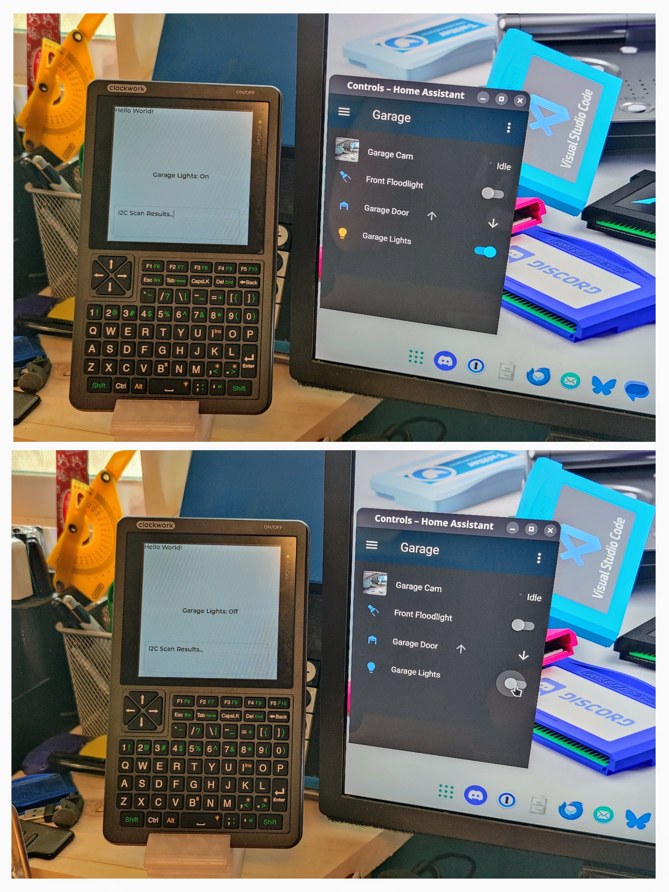

# Using the PicoCalc with Home Assistant

This example demonstrates how to use your PicoCalc with Home Assistant via the [ESPHome Project (https://esphome.io/)](https://esphome.io/)

## Prerequisites

* A working Home Assistant installation with ESPHome installed
* PicoCalc with a Pi Pico 2040 W or Pi Pico 2 2350

## Setup
The easiest way to get started is to use the ESPHome dashboard and make a new device,
get your Pi Pico W flashed and registered/connected with ESPHome.

You can then copy the configuration bit you want from picocalc.yaml into your
new devices configuration and you can now reflash wirelessly.

## Current Status

What Works:
* WiFi
* SPI with the Display
* LVGL (UI) with widgets and updates
* OTA Updates
* Using a text_sensor to live-update my garage light status (example)

## TODO (in no particular order):

- [ ] Enable I2C
- [ ] Enable the keyboard
- [ ] Enable Backlight Adjustment
- [ ] Enable Backlight Keyboard
- [ ] Enable the SD card
- [ ] Enable the GPIO pins
- [ ] Enable Audio
- [ ] Enable... whatever else.