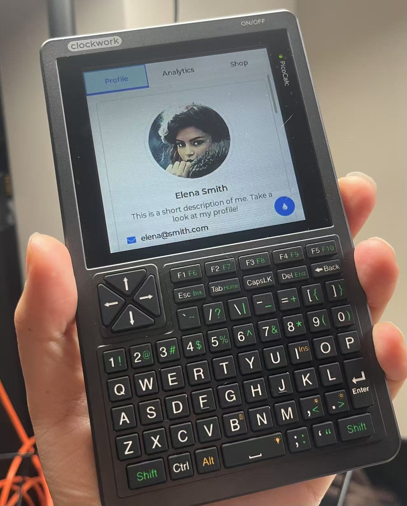

# PicoCalc LVGL Graphics Demo

This repository provides a template demo application utilizing the LVGL graphics engine on the PicoCalc.





### Tasks
#### Completed
- [x] Added support for both Pico 1 and Pico 2 builds.
- [x] Integrated the LVGL project framework.
- [x] Ported I2C keyboard functionality for LVGL.
- [x] Implemented SPI display support for LVGL.
- [x] Enabled bitmap driver flushing.

#### Todos
- [ ] eEnhance keyboard event processing.

## Build Instructions
```bash
# Clone the LVGL submodule (one-time setup)
git submodule update --init --recursive

# ------------------------------
# Navigate to the demo project directory
cd {path_to_this_demo}

# Create and enter the build directory
mkdir build
cd build

# Set the PICO SDK path
export PICO_SDK_PATH=/path/to/pico-sdk

# Configure and build the project
cmake ..
make
```


## Build for Pico 1(RP2040) or Pico 2(RP2350)
if you are using other pico board, you could select a board type from the `CMakeLists.txt`

```cmake
# Setup board for Pico 1
set(PICO_BOARD pico)

# Setup board for Pico 2W
# set(PICO_BOARD pico2)
```

## How to Upload UF2 

Uploading a UF2 file to the Raspberry Pi Pico on a Linux system is straightforward. Here’s how you can do it:

### Step 1: Prepare Your Raspberry Pi Pico
Enter Bootloader Mode:

- Hold down the BOOTSEL button on your Pico.
- While holding the button, connect the Pico to your Linux PC via USB.
- Release the BOOTSEL button.
- Check If the Pico Is Recognized:

Your Pico should appear as a mass storage device named RPI-RP2.

Verify using the following command:

```bash
lsblk
```

You should see a new device (e.g., /media/$USER/RPI-RP2 or /run/media/$USER/RPI-RP2).

### Step 2: Copy the UF2 File to the Pico
```
cp your_firmware.uf2 /media/$USER/RPI-RP2/
```

### Step 3: Run it
On PicoCalc, the default serial port of the Pico is the USB Type-C port, not its built-in Micro USB port.  
So here is the standard running procedures: 

- Unplug the pico from Micro-USB cable
- Plug the pico via USB Type-C
- Press Power On on Top of the PicoCalc


If your firmware includes serial output, you can monitor it using **minicom** or **screen**:   
```bash
screen /dev/ttyACM0 115200
```

(Replace /dev/ttyACM0 with the correct serial port for your Pico.)  

The serial monitor of **Arduino IDE** is another great choice for PicoCalc serial output on both Linux and Windows.


#### Special thanks
[Hsuan Han Lai](https://github.com/adwuard) for initial porting and demo project for the PicoCalc 
